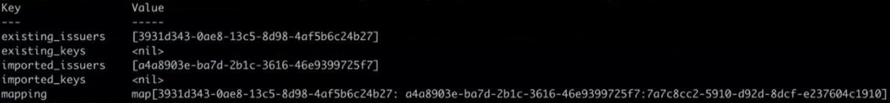

If the list of issues needs to be all-inclusive, then start with the [Maintain Issuers](#Maintain-Issuers) section

> The below steps are also defined in the operatorvault repo in `operatorvault/mgmt/docs/Configure_Vault_as_a_Certificate_Authority`. Simply execute the script with the name of the MZR. (Note: any string is accepted). The script will then output the vault commands that be copy/pasted to perform the following tasks.

## Note: a KT session video of the below is also captured in Confluence [here](https://confluence.swg.usma.ibm.com:8445/display/VAUL/KT+Session+-+QZ2+Cert+Rotation)
## Export VAULT_TOKEN environment variable, if not already done so
```
export VAULT_TOKEN=<vault_root_token>
```

## Generate a Certificate Signing Request (CSR)
```
vault write -format=json intermediary_ca/intermediate/generate/internal ttl="43800h" key_bits=4096 common_name="Operator Vault - QZ2 Intermediate Authority" issuer_name='americas-intermediate-apr2024' | jq -r ".data.csr" > intermediary-signing-request.csr
```
> The issuer name can be any value. It's simply used for reference. As demonstrated, we simply appended the date that the certificate was generated

## Sign the CSR using the Georegional's Root CA endpoint
Currently all georegions share the same Root CA endpoint
```
vault write -format=json root_ca/root/sign-intermediate csr=@intermediary-signing-request.csr ttl="43800h" format=pem_bundle | jq -r ".data.certificate" > "intermediary.cert.pem"
```

## Verify new CA certificate
Verify the correctness of the generated certificate and chain of issuing CAs. Note the below commands only work for RSA certificates

```
openssl crl2pkcs7 -nocrl -certfile intermediate.cert.pem | openssl pkcs7 -print_certs -noout -text
```

## List the issuers
```
vault list -detailed intermediary_ca/issuers
```

## Update/send the pem bundle
```
vault write intermediary_ca/config/ca pem_bundle=@intermediary.cert.pem
```
Note: make note of the output. Specifically the value of `imported_issuers`


## Set the follows issuer
Note: replace the value of `default` with the value captured above. ie. `a4a...5f7`
```
curl --request POST --data '{ "default": "<use_value_of_imported_issuers_from_above_step>","default_follows_latest_issuer": "true"}' --header "X-Vault-Token: $(vault print token)" https://127.0.0.1:8200/v1/intermediary_ca/config/issuers
```

## Set the issuer name
Note: replace `<use_imported_issuers_value_here_too>` with the same `imported_issuers` value from above
```
vault write intermediary_ca/issuer/<use_imported_issuers_value_here_too> issuer_name="qz2-intermediate-apr2024"
```

## Set as default issuer
```
vault write intermediary_ca/root/replace default=qz2-intermediate-apr2024
```

## Verify the addition of the new generated certificate. It should be the first in the chain
```
curl --silent https://127.0.0.1:8200/v1/intermediary_ca/ca/pem | openssl x509 -text | head -20
```
> To capture the entire certificate, simply remove the `|head -20` suffix from the above statement

## Testing


## Maintain Issuers
If the list of issuers needs to be included, execute the below steps
> Verify attribute 'default_follows_latest_issuer' set to 'true' for the endpoint
Any renewals will not become the new issuer automatically unless the attribute 'default_follows_latest_issuer' set to 'true'
This is a new attribute added in vault 1.11.x, but any new endpoint should be configured with this setting and any existing endpoint should be checked to ensure the attribute is correctly configured
#### Retrieve the current endpoint's settings
```
endpoint config
```
### Retrieve the current list of issuers
```
vault read -field=default intermediary_ca/config/issuers
```
#### If necessary, add the attribute 'default_follows_latest_issuer' with a value of 'true'. In the below example, the issuer's ID was retrieved in the above step. The most current issuer should be set as the default
```
curl --request POST --data '{ "default": "111eb5b8-9382-b9ff-8f66-0f70dd884500","default_follows_latest_issuer": "true"}' --header "X-Vault-Token: $(vault print token)" https://127.0.0.1:8200/v1/intermediary_ca/config/issuers 
```

<br>

#### Reference
[Default Follows Latest Issuer](https://developer.hashicorp.com/vault/api-docs/secret/pki#default_follows_latest_issuer)

{"request_id":"ef4bc577-9d92-4cd0-962e-a5c413515809","lease_id":"","renewable":false,"lease_duration":0,"data":{"default":"111eb5b8-9382-b9ff-8f66-0f70dd884500","default_follows_latest_issuer":true},"wrap_info":null,"warnings":null,"auth":null}

> add examples from hashicorp ticket